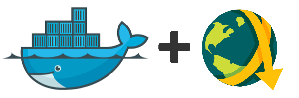

JDownloader 2 - Docker Image
==========================

[](http://github.com/jaymoulin/docker-jdownloader/releases)
[](https://hub.docker.com/r/jaymoulin/jdownloader/)
[](https://hub.docker.com/r/jaymoulin/jdownloader/)
[](https://www.paypal.me/jaymoulin)
[](https://www.buymeacoffee.com/3Yu8ajd7W)
[](https://patreon.com/jaymoulin)

(This product is available under a free and permissive license, but needs financial support to sustain its continued improvements. In addition to maintenance and stability there are many desirable features yet to be added.)

This image allows you to have JDownloader 2 daemon installed easily thanks to Docker.

Installation
---

Here are some examples to get started with the creation of this container.

### Docker
```
docker run -d --init --restart=always -v </path/to/downloads>:/opt/JDownloader/Downloads -v </path/to/appdata/config>:/opt/JDownloader/cfg --name jdownloader -u $(id -u) -p 3129:3129 -e MYJD_USER=email@email.com -e MYJD_PASSWORD=bar -e MYJD_DEVICE_NAME=goofy jaymoulin/jdownloader
```
### Docker Compose
```yml
services:
   jdownloader:
    image: jaymoulin/jdownloader
    container_name: jdownloader
    restart: always
    user: 1001:100
    volumes:
        - </path/to/appdata/config>:/opt/JDownloader/cfg
        - </path/to/appdata/logs>:/opt/JDownloader/logs #optional
        - </path/to/downloads>:/opt/JDownloader/Downloads #optional
        - /etc/localtime:/etc/localtime:ro #optional
    environment: 
            MYJD_USER: email@email.com
            MYJD_PASSWORD: bar
            MYJD_DEVICE_NAME: goofy #optional
            XDG_DOWNLOAD_DIR: /downloads #optional
    ports:
        - 3129:3129 
```

*Note for RPI Zero* : specify that you want the arm32v6 image (e.g. jaymoulin/jdownloader:0.7.0-arm32v6) because rpi zero identify itself as armhf which is wrong.

Configuration
---
You can set many parameters when you configure this container, but you must specify your MyJDownloader login/password to connect to your container.

### Configuration values 
| Parameter | Function |
| :----: | --- |
| `-v /opt/JDownloader/cfg`| Config file folder, saves your configuration on the host |
| `-v /opt/JDownloader/logs` | Container logs folder, specify it only if you wan to keep logs on the host |
| `-v /opt/JDownloader/Downloads` | Downloads folder | 
| `-u <UID>:<GID>` | Add user identifiers to run the container with user priviledges. To obtain such values, run on your host `id yourusername`, additional information can be found in [Docker documentation](https://docs.docker.com/engine/reference/commandline/exec/#options)
| `-p 3129:3129` | This Network port is required for Direct Connections, more information in [this section](https://github.com/jaymoulin/docker-jdownloader#direct-connection) |

### Environment Variables
| Parameter | Function |
| :----: | --- |
| `MYJD_USER=email@email.com` | Your MyJDownloader user |
| `MYJD_PASSWORD=foo` | Your MyJDownloader password |
| `MYJD_DEVICE_NAME=goofy`| The device name that will appear on MyJdownloader portal |
| `XDG_DOWNLOAD_DIR=/opt/JDownloader/Downloads` | If you use this variable, set it as per the downloads folder volume! |


If haven't set MYJD_USER and MYJD_PASSWORD values, you can still configure an account by running

```
docker exec jdownloader configure email@email.com password
```

Other options can be changed on your MyJDownloader account : https://my.jdownloader.org/index.html#dashboard.

Appendixes
---

### Direct Connection

To enable Direct Connection mode from internet, you need to forward the port 3129 in your Router. Please find more information in this [JDownloader's article](https://support.jdownloader.org/Knowledgebase/Article/View/33/0/myjdownloader-advanced-settings)

**DNS Rebind Warning** if you are running a router like Fritz!Box, Asus, OpenWRT, DDWRT, pfSense or any other 3rd party *advanced* routers you may have DNS Rebind Protection enabled: Direct Connections will not work, you will have to explicitly whitelist `mydns.jdownloader.org`. The procedure is different for every router, here are some tips:

* Fritz!Box: [KB Article](https://support.jdownloader.org/Knowledgebase/Article/View/51) from JDownloader
* Asus Merlin: Follow [this procedure](https://github.com/RMerl/asuswrt-merlin.ng/wiki/Custom-domains-with-dnsmasq) to enable custom scripts and edit the dnsmasq file, then add the line `rebind-domain-ok=/mydns.jdownloader.org/`
* OpenWRT: browse to Network>DHCP and DNS>General Settings and add `mydns.jdownloader.org` to Domain Whitelist
* pfSense: more information [here](https://github.com/jaymoulin/docker-jdownloader/issues/61#issuecomment-607474205)

As @jiaz83 stated
> short explanation what the direct connection mode does.
> client(app,webinterface,tool...)<-....->JDownloader connections happens either
> 
> 1.) client<-apiserver->JDownloader
> in this(default,fallback) mode both(control- and data-) connections are using the api server.
> Advantage: no need to forward ports/dyndns
> Disadvantage: lower bandwidth and higher latency
> 
> 2.) client<->JDownloader
> in this (direct connection) mode, control connections are still using the api server while data connections are directly connecting to the running JDownloader instance without any relay server
> Advantage: much higher bandwidth and reduced latency
> Disadvantage: user might have to manually enable/allow port forwarding from LAN and/or WAN IP to JDownloader instance
> On connection issues, the client will automatically fallback to 1.) and try to re-establish a direct connection again.
> 
> by default direct connection mode is set to LAN, so only clients from LAN can connect directly.
> see https://support.jdownloader.org/Knowledgebase/Article/View/33/0/myjdownloader-advanced-settings
> default port is 3129

### Direct Connection using a Bridged Network

To get Direct Connection when using a bridged newtwork, please follow these steps:

* Expose 3129 port when creating the container (`-p 3129:3129` parameter)
* When JDownloader is running, navigate to Settings > Advanced Settings > Search for "myjdownloader" > Find *MyJDownloaderSettings: Custom Device IPs* and enter your host LAN IP using this formatting `["192.168.1.10"]`. If you need to specify more IPs use `["192.168.1.10","10.10.10.10"]`
* Set *MyJDownloaderSettings: Manual Local Port* to `3129`
* Set *MyJDownloaderSettings: Direct Connect Mode* to `Allow lan/wan connections with manual port forwarding`
* Restart JDownloader, connections will now be direct

### Debugging

You can put a file called `jdownloader-block.txt` file in your Download folder to pose the container start.
This will allow to connect to the container with a shell to debug. (`docker exec -it jdownloader sh`) 

### Install Docker

If you don't have Docker installed yet, you can do it easily in one line using this command
 
```
curl -sSL "https://gist.githubusercontent.com/jaymoulin/e749a189511cd965f45919f2f99e45f3/raw/0e650b38fde684c4ac534b254099d6d5543375f1/ARM%2520(Raspberry%2520PI)%2520Docker%2520Install" | sudo sh && sudo usermod -aG docker $USER
```


